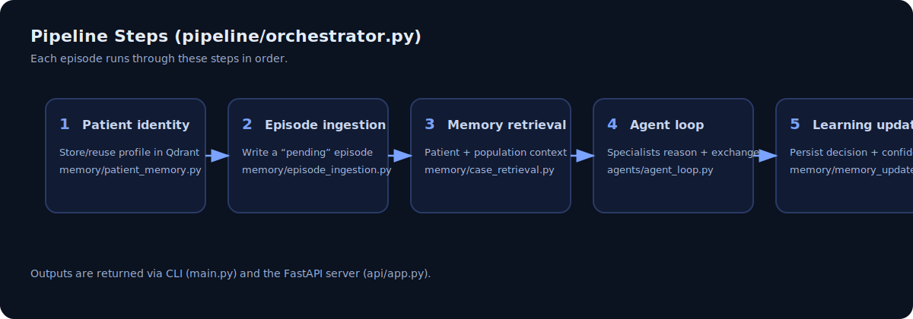

# Memory-Augmented Multi-Agent Medical Reasoning System

Research-grade prototype for **memory-augmented clinical decision support**:

- **Vector memory (Qdrant)** stores patient profiles + past reasoning episodes
- **Memory-RAG retrieval** brings relevant prior context into the current case
- **Multi-agent specialist loop** (cardiology / neurology / psychiatry / safety)
- **Consensus synthesis** produces a final structured recommendation
- **Learning update** writes outcomes back to long-term memory

> Disclaimer: This repository is for **research/education**. It is **not a medical device** and does **not** provide medical diagnosis. Use qualified clinical judgment and appropriate investigations.

## Architecture


### Orchestrator flow (Steps 1 → 5)



## What’s in the box

- **CLI runner**: `main.py` (interactive patient/episode intake)
- **FastAPI server + minimal UI**: `api/app.py`
- **Pipeline orchestrator**: `pipeline/orchestrator.py`
- **Memory** (Qdrant-backed): `memory/patient_memory.py`, `memory/qdrant_memory.py`
- **Agents**: `agents/specialists.py`, `agents/agent_loop.py`
- **Consensus**: `agents/consensus.py`
- **Report formatting**: `utils/output_formatter.py`

## Requirements

- Python 3.10+ recommended
- A running Qdrant instance (local Docker or Qdrant Cloud)
- A Groq API key (for LLM calls)

## Setup

### 1) Create a virtual environment

Windows PowerShell:

```powershell
python -m venv venv
venv\Scripts\Activate.ps1
python -m pip install --upgrade pip
```

### 2) Install dependencies

```bash
pip install -r requirements.txt
```

If you hit missing-module errors at runtime, confirm these are installed:

- `python-dotenv`
- `groq`
- `sentence-transformers`

### 3) Start Qdrant (local, Docker)

```bash
docker run --rm \
	-p 6333:6333 -p 6334:6334 \
	-v qdrant_storage:/qdrant/storage \
	qdrant/qdrant
```

Qdrant UI/API should be reachable at `http://localhost:6333`.

### 4) Configure environment variables

Create a `.env` file in the repo root (it is ignored by git):

```ini
# Qdrant
QDRANT_URL=http://localhost:6333
QDRANT_API_KEY=

# Groq
GROQ_API_KEY=your_key_here
```

## Run

### Option A: CLI (interactive)

```bash
python main.py
```

### Option B: Web API + minimal UI

```bash
uvicorn api.app:app --reload
```

Then open:

- UI: `http://127.0.0.1:8000/`
- API: `POST http://127.0.0.1:8000/submit-episode`

Example request:

```bash
curl -X POST "http://127.0.0.1:8000/submit-episode" \
	-H "Content-Type: application/json" \
	-d '{
		"patient": {"name": "Anonymous", "age": 21, "gender": "male", "known_conditions": ["anxiety"], "medications": [], "past_similar_episodes": true},
		"episode": {"symptoms": ["heart racing", "dizziness"], "duration_minutes": 10, "severity": 7, "triggers": ["stress"]}
	}'
```

## Tests / sanity scripts

This repo includes lightweight scripts under `test/`. You can run them directly:

```bash
python test/test_orchestrator.py
python test/test_agents.py
python test/test_ingestion.py
python test/test_retrieval.py
```

## Project structure

```
api/            FastAPI app + minimal UI
agents/         Specialist agents + consensus
llm/            Groq client wrapper
memory/         Qdrant-backed memory + schemas + retrieval
pipeline/       Step-by-step orchestration
utils/          Output formatting
test/           Sanity scripts
assets/         README diagrams
```

## Notes

- The system stores embeddings via `sentence-transformers` and persists vectors + metadata in Qdrant.
- The LLM layer uses Groq chat completions (see `llm/groq_client.py`).
- Do not commit secrets: keep your `.env` local (already gitignored).

## License

See [LICENSE](LICENSE).